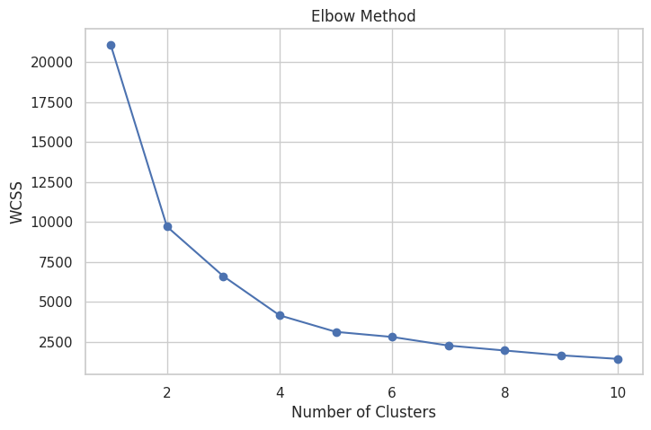
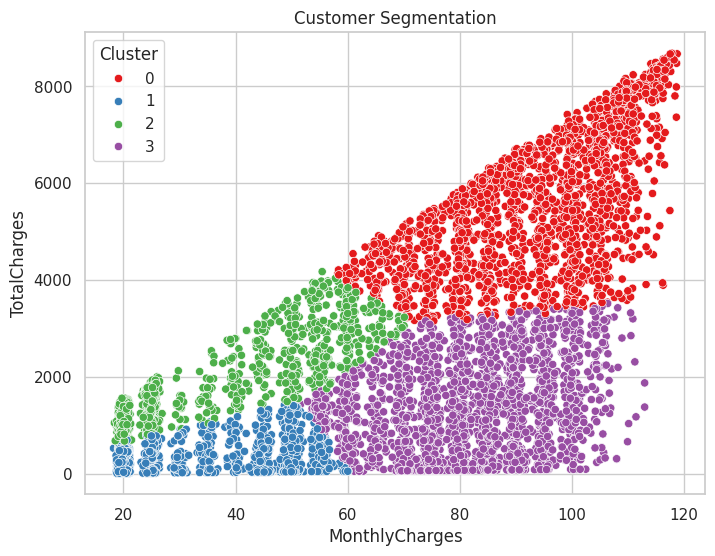
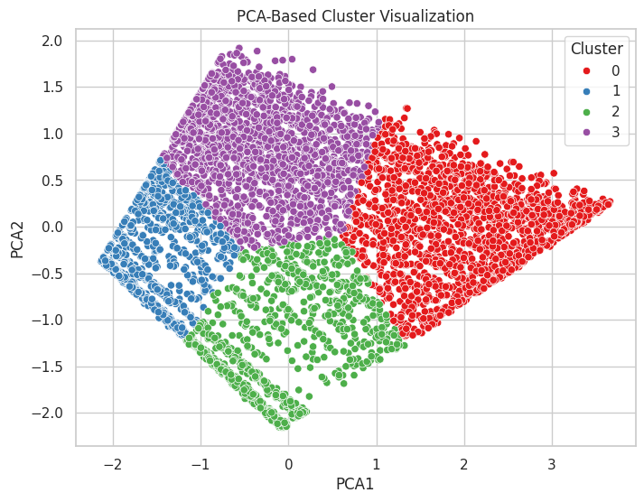

# 📊 Customer Segmentation using K-Means Clustering

## 🚀 Project Overview

This project applies **unsupervised machine learning (K-Means clustering)** to segment telecom customers into meaningful groups based on behavioral patterns.

The goal is to support **data-driven business decisions** such as:

* Customer retention
* Targeted marketing
* Personalized services

---

## 📁 Dataset

* Source: Telco Customer Churn Dataset
* Records: 7,043 customers
* Features used:

  * Tenure
  * Monthly Charges
  * Total Charges

---

## ⚙️ Tech Stack

* Python
* Pandas, NumPy
* Scikit-learn
* Matplotlib, Seaborn

---

## 🔍 Methodology

### 1. Data Preprocessing

* Converted `TotalCharges` to numeric
* Removed missing values
* Dropped unnecessary columns

### 2. Feature Scaling

* StandardScaler applied for normalization

### 3. Optimal Cluster Selection

* Elbow Method
* Silhouette Score

### 4. Model Building

* K-Means clustering (K=4)

### 5. Visualization

* Scatter plots
* PCA-based visualization
* Boxplots for cluster analysis

---

## 📊 Key Visualizations

### 🔹 Elbow Method

### 🔹 Customer Segmentation

### 🔹 PCA Visualization

---

## 📈 Cluster Insights

| Cluster | Description                                    |
| ------- | ---------------------------------------------- |
| 0       | New Customers (Low tenure, low spending)       |
| 1       | High-Value Customers (Loyal, high spending)    |
| 2       | High-Risk Customers (High charges, low tenure) |
| 3       | Moderate Customers                             |

---

## 💡 Business Insights

* 🎯 Target high-risk customers with retention offers
* 💎 Reward loyal customers with premium services
* 📢 Improve onboarding for new customers
* 📈 Upsell moderate customers

---

## 🧠 Key Learnings

* Importance of feature scaling in clustering
* Choosing optimal K using validation techniques
* Interpreting clusters for business value

---

## 📌 Future Improvements

* Add more features (contract type, services)
* Try advanced clustering (DBSCAN, Hierarchical)
* Deploy as an interactive dashboard

---

## 👨‍💻 Author

**Mohammad Saiful Alam**
Research Officer | Data Science Enthusiast
